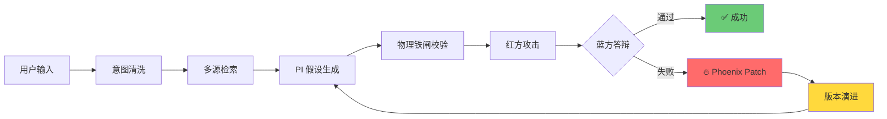
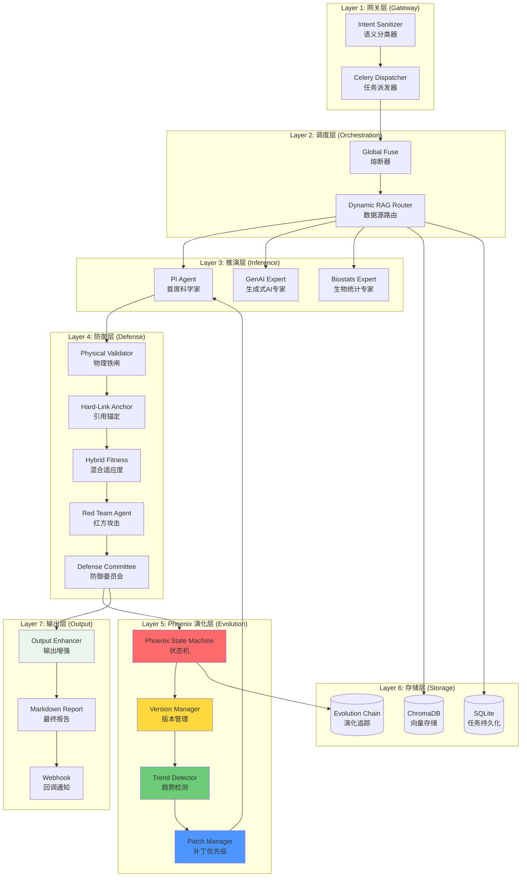

# 🔬 V7.5 Phoenix Protocol - Research Hypothesis Agent

**全域通用、24小时无人值守的自动化科研假说生成与演化引擎**

[](https://www.python.org/downloads/)
[](https://opensource.org/licenses/MIT)
[](https://streamlit.io/)
[](https://docs.celeryproject.org/)
[]()

---

## 🎯 项目愿景

**科研不是 ChatGPT 的问答游戏，而是精密的逻辑推演与对抗验证。**

V7.5 Phoenix Protocol 是一台**科研级精密仪器**，而非简单的 AI 聊天机器人。我们通过**凤凰协议演化机制**重构了科研假设生成范式——**从阻断型逻辑升级为演化型逻辑**。

### V7.5 核心升级

| 特性 | V7.1 | V7.5 Phoenix |
|------|------|--------------|
| 失败处理 | 直接熔断 | 演化重写 |
| 迭代上限 | 4 次 | 8 次 |
| 分数停滞 | 无检测 | 自动触发外部补偿 |
| 版本追踪 | 无 | 完整演化链 (v1.0 → v1.1 → v2.0) |
| 输出增强 | 基础报告 | Roadmap + Innovation + Frontier |
| 持久化 | 无刷新恢复 | SQLite 瞬时恢复 |

---

## 🔥 Phoenix 协议核心机制

当人类科学家提出一个研究想法时，V7.5 会：



### 1. 演化型逻辑（而非阻断型）
- **物理冲突 → 重写**，而非直接拦截
- **蓝方失败 → 补丁注入**，而非终止
- **分数停滞 → 外部补偿**，而非放弃

### 2. Phoenix 状态机

| 状态 | 描述 | 触发条件 |
|------|------|----------|
| `INITIAL` | 初始输入 | 用户提交 |
| `HYPOTHESIS_GEN` | PI 假设生成 | 检索完成 |
| `RED_ATTACK` | 红方攻击审计 | 假设生成完成 |
| `BLUE_DEFENSE` | 蓝方答辩审查 | 红方攻击完成 |
| `🔥 PHOENIX_REWRITE` | 物理锚定重写 | 物理公理冲突 |
| `🧬 PHOENIX_PATCH` | 方法论补丁注入 | 蓝方答辩失败 |
| `🔄 PHOENIX_RETRY` | 补丁后重试 | 补丁应用完成 |
| `⚠️ SCORE_STagnant` | 分数停滞检测 | 连续2轮无提升 |
| `📡 EXTERNAL_COMPENSATION` | 外部算法补偿 | 停滞触发 |
| `✅ SUCCESS` | 最终成功 | Science Score ≥ 8.5 |
| `❌ HARD_FAILURE` | 硬性失败 | 不可修复冲突 |
| `⏰ MAX_PHOENIX_EXCEEDED` | 超过演化上限 | 迭代 > 8 次 |

### 3. 版本演化链

每个假设都会形成完整的版本历史：

```text
v1.0 (初始版本, Science Score: 6.5)
  ↓ 红方攻击：数据泄露
v1.1 (方法论补丁, Science Score: 7.8)
  ↓ 红方攻击：内生性偏倚
v1.2 (方法论补丁, Science Score: 8.2)
  ↓ 蓝方通过
✅ v1.3 (最终版本, Science Score: 8.9)
```

---

## 📊 架构拓扑



---

## 🔄 15 步全链路工作流

| 步骤 | 名称 | 描述 | 关键机制 |
|:---:|------|------|----------|
| 1 | Intent Sanitizer | 语义分类预检 | LLM 意图判定 |
| 2 | Celery Dispatch | 异步任务派发 | Redis 消息队列 |
| 3 | Global Fuse Init | 熔断器初始化 | API 限流保护 |
| 4 | Dynamic RAG Router | 数据源动态路由 | 跨学科感知 |
| 5 | PubMed Search | ��物医学文献检索 | PMID 锚定 |
| 6 | ArXiv/S2 Search | 预印本/全学科检索 | ArXiv ID/DOI 锚定 |
| 7 | **Physical Validator** | **物理铁闸校验** | **零容忍编造** |
| 8 | PI Hypothesis Gen | 首席科学家假设生成 | 因果链 X → M → Y |
| 9 | **Hard-Link Anchor** | **引用硬链接校验** | **PMID/ArXiv/DOI** |
| 10 | **Hybrid Fitness** | **混合适应度评估** | **向量 × 严谨性 × 权重** |
| 11 | **Red Team Attack** | **红方攻击审计** | **Nature 级审稿** |
| 12 | Defense Committee | 防御委员会终审答辩 | 裁决通过/失败 |
| 13 | **Convergence Check** | **收敛性检测** | **Phoenix 演化判定** |
| 14 | Report Generation | Markdown 报告生成 | 输出增强模块 |
| 15 | Webhook Callback | 异步回调通知 | 任务完成投递 |

---

## 🛡️ 红方攻击检查清单

红方智能体以 **Nature 审稿人** 标准攻击假设，重点检查：

| 攻击类型 | 检查内容 | 严重级别 |
|----------|----------|----------|
| **Data Leakage** | CV外特征选择、信息泄露、样本泄漏 | 💀 致命 |
| **Endogeneity** | 未闭合后门路径、遗漏变量偏倚 | 💀 致命 |
| **Multiple Testing** | FDR/Bonferroni 校正缺失、P-hacking | ⚠️ 严重 |
| **Statistical Power** | 样本量不足、功效分析缺失 | ⚠️ 严重 |
| **Causal Inference** | DAG 不完整、敏感性分析缺失 | ⚠️ 严重 |
| **Reproducibility** | 随机种子未固定、代码未公开 | 📝 中等 |

---

## 📈 输出增强模块

V7.5 生成三种增强输出，形成完整科研资产：

### 1. Implementation Roadmap (落地路线图)
- **阶段规划**：Phase 1/2/3 定义
- **资源需求**：GPU 类型/小时数、数据集权限
- **时间线**：里程碑与验证周期
- **风险评估**：技术风险与应对策略
- **预算估算**：算力、数据、人力成本

### 2. Innovation Analysis (创新分析)
- **核心创新点**：方法学突破识别
- **新颖度等级**：breakthrough / incremental
- **差异化分析**：与现有研究的对比
- **突破潜力**：Science Score 与 Promise Score

### 3. Frontier Analysis (前沿分析)
- **前沿定位**：2026 SoTA 对比
- **关键出版物**：支撑文献解读
- **研究趋势**：领域发展动向
- **Gap Analysis**：研究空白识别
- **引用速度**：citation_velocity 评估

---

## 🔧 工程化能力

### SQLite 持久化与刷新恢复

```text
页面刷新
  → recover_lost_task_on_reload()
  → SQLite task_registry 查询
  → 恢复 task_id / session_state
  → 继续轮询
```

**支持的恢复场景**：
- 浏览器刷新
- Tab 切换
- 多 Tab 竞态防护
- 24 小时内任务召回

### JSON 序列化稳定性

```python
# 自动处理 numpy 类型
convert_numpy_types(result)
  → np.int64 → int
  → np.float32 → float
  → np.ndarray → list
```

**支持的演化轮次**：≥ 9 轮 history 无溢出

---

## 🚀 快速开始

### 环境要求

- Python 3.9+
- Redis 6.0+
- 4GB+ RAM

### 1. 克隆仓库

```bash
git clone https://github.com/your-org/research-hypothesis-agent.git
cd research-hypothesis-agent
```

### 2. 创建虚拟环境

```bash
python -m venv venv
source venv/bin/activate  # Linux/Mac
# 或
venv\Scripts\activate     # Windows
```

### 3. 安装依赖

```bash
pip install -r requirements.txt
```

### 4. 配置环境变量

```bash
cp .env.example .env
# 编辑 .env 文件，填入你的 API Keys
```

**核心配置变量**：

```bash
# Anthropic API (Claude 模型)
ANTHROPIC_API_KEY=sk-ant-xxxxx
CLAUDE_MODEL=claude-sonnet-4-6

# 数据库
DATABASE_URL=sqlite:///./data/research.db

# PubMed API (可选，提高请求限制)
PUBMED_API_KEY=your_ncbi_api_key
PUBMED_EMAIL=your_email@example.com

# Redis (Celery 消息队列)
REDIS_URL=redis://localhost:6379/0

# Phoenix 协议配置
PHOENIX_MAX_ITERATIONS=8
PHOENIX_SUCCESS_THRESHOLD=8.5
```

### 5. 启动 Redis (Docker)

```bash
docker run -d -p 6379:6379 redis:6-alpine
```

### 6. 启动 Celery Worker

```bash
# 终端 1: 启动 Worker
celery -A src.core.celery_tasks_v75 worker --loglevel=info --pool=solo
```

### 7. 启动 Streamlit 前端

```bash
# 续端 2: 启动 UI
streamlit run app_v7.py
```

访问 `http://localhost:8501` 开始使用。

---

## 🧪 测试验证

### 核心测试文件

| 测试文件 | 测试内容 |
|----------|----------|
| `test_v75_integration.py` | Phoenix 状态机、版本链、分数趋势 |
| `test_v75_e2e_audit.py` | 状态转换一致性、JSON 序列化、SQLite 持久化 |
| `test_output_enhanced.py` | Roadmap、Innovation、Frontier 输出完整性 |

### 运行测试

```bash
# 运行 V7.5 集成测试
python test_v75_integration.py

# 运行 E2E 审计测试
python test_v75_e2e_audit.py

# 运行输出增强测试
python test_output_enhanced.py
```

---

## 📁 项目结构

```text
research-hypothesis-agent/
├── app_v7.py                    # Streamlit 前端主入口
├── src/
│   ├── core/
│   │   ├── phoenix_state_machine.py    # 🔥 Phoenix 状态机
│   │   ├── celery_tasks_v75.py         # Celery 主任务编排
│   │   ├── hypothesis_version_manager.py # 版本演化链管理
│   │   ├── output_enhancer.py          # 输出增强模块
│   │   ├── score_trend_detector.py     # 分数趋势检测
│   │   ├── promise_score_calculator.py # Promise Score 计算
│   │   ├── methodology_patch_priority.py # 补丁优先级管理
│   │   ├── hybrid_fitness.py           # 混合适应度评分
│   │   ├── physical_validator.py       # 物理铁闸校验
│   │   └── convergence_detector.py     # 收敛检测
│   ├── agents/
│   │   ├── hypothesis_agent.py         # PI 假设生成
│   │   ├── red_team_agent.py           # 红方攻击智能体
│   │   └── defense_committee_agent.py  # 防御委员会智能体
│   ├── prompts/
│   │   └── phoenix_rewrite_prompt.py   # Phoenix 重写提示词
│   ├── utils/
│   │   ├── pubmed.py                   # PubMed 检索
│   │   ├── logger.py                   # 集中式日志系统
│   │   └ report_export.py              # Markdown 报告导出
│   └── data_sources/
│       └ semantic_scholar_searcher.py  # Semantic Scholar 检索
├── data/
│   └ research.db                       # SQLite 主数据库
│   └ task_persistence.db               # 任务持久化数据库
├── reports/                            # 生成的报告 (.gitignore)
├── logs/                               # 系统日志 (.gitignore)
├── test_v75_integration.py             # V7.5 集成测试
├── test_v75_e2e_audit.py               # E2E 审计测试
└── test_output_enhanced.py             # 输出增强测试
```

---

## 🌐 支持的学科领域

| 类别 | 领域 |
|------|------|
| **物理科学** | physics, chemistry, astronomy |
| **形式与计算机科学** | computer_science, mathematics, artificial_intelligence |
| **工程与材料科学** | materials_science, engineering |
| **地球与环境科学** | environmental_science, geoscience |
| **生命科学与医学** | medicine, biology, neuroscience, genomics, proteomics, immunology, pharmacology |
| **计算生物学** | bioinformatics, biostatistics, computational_biology |
| **社会科学** | psychology, economics |

---

## 📊 Phoenix 协议配置

```yaml
# src/core/phoenix_state_machine.py
PHOENIX_CONFIG:
  MAX_PHOENIX_ITERATIONS: 8      # 最大演化迭代次数
  MAX_REWRITE_ATTEMPTS: 3        # 物理锚定重写上限
  MAX_PATCH_ATTEMPTS: 5          # 方法论补丁上限
  SCORE_STagnant_THRESHOLD: 2    # 停滞判定阈值
  SCORE_RISE_MIN_DELTA: 0.5      # 每轮最小上升
  MIN_SUCCESS_SCORE: 8.5         # 成功最低阈值
  COMPENSATION_SEARCH_DEPTH: 3   # 外部补偿检索深度
```

---

## 🔒 防御层配置

```yaml
# program.yaml
defense_layer:
  intent_sanitizer_enabled: true
  hard_link_anchor_enabled: true
  physical_validator_strict_mode: true
  hard_cap: 8  # Phoenix 最大迭代

hypothesis_generation:
  min_score_threshold: 7.5  # 混合适应度最低阈值

paper_search:
  min_if: 3.0  # 最低影响因子
  date_range_start: "2020-01-01"
  date_range_end: "2026-12-31"
```

---

## 📝 开发者规范

### 分支管理

```
main           ──────> 生产环境 (V7.5 Release)
  ├─ develop   ──────> 开发环境 (V7.5-SNAPSHOT)
  ├─ feature/* ──────> 功能分支
  ├─ hotfix/*  ──────> 紧急修复
  └─ release/* ──────> 发布准备
```

### Git Commit 规范

```
<type>(<scope>): <subject>

type: feat|fix|docs|style|refactor|test|chore
scope: phoenix|agent|gateway|orchestrator|storage|ui|output
subject: 简短描述 (<= 50 字符)

示例:
feat(phoenix): 添加分数停滞检测与外部补偿触发
fix(agent): 修复红方攻击 numpy 类型序列化问题
refactor(output): 重构输出增强模块为三类结构
test(phoenix): 添加 V7.5 E2E 审计测试脚本
```

---

## 🤝 贡献指南

我们欢迎以下形式的贡献：

1. **Phoenix 协议增强** — 新的状态、触发器、演化策略
2. **输出模块扩展** — 新的科研资产维度
3. **领域支持扩展** — 新的 RAG Router 数据源
4. **防御层增强** — 新的验证机制或审计维度
5. **性能优化** — 减少延迟、提高吞吐

提交 PR 前，请确保：

- [ ] 所有测试通过
- [ ] 代码符合 PEP 8
- [ ] 添加了必要的 Docstring
- [ ] 更新了相关文档

---

## 📄 许可证

MIT License - 详见 [LICENSE](LICENSE)

---

## 🙏 致谢

V7.5 Phoenix Protocol 的架构设计深受以下启发：

- **Nature 系列期刊** 的审稿标准
- **Causal Inference** (Pearl, 2009) 的因果图理论
- **Red Teaming** 在 AI 安全领域的实践
- **Multi-Agent Systems** 的对抗协作范式
- **Evolutionary Algorithms** 的迭代优化思想

---

<div align="center">

**V7.5 Phoenix Protocol - Research Hypothesis Agent**

*失败不是终点，而是演化的起点。*

**这不是魔法，这是工程。**

</div>