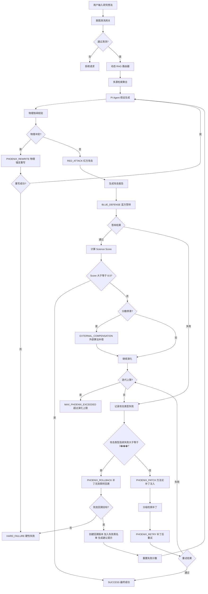
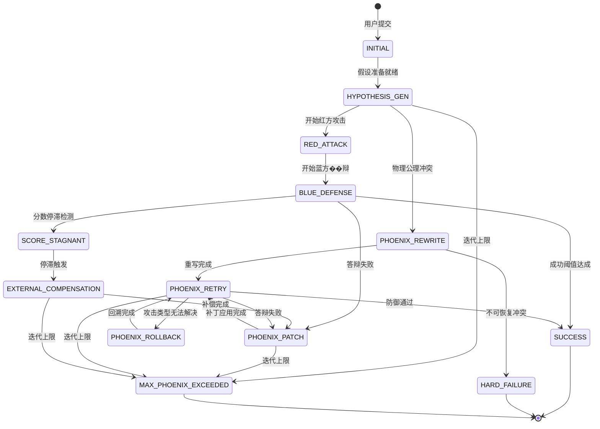
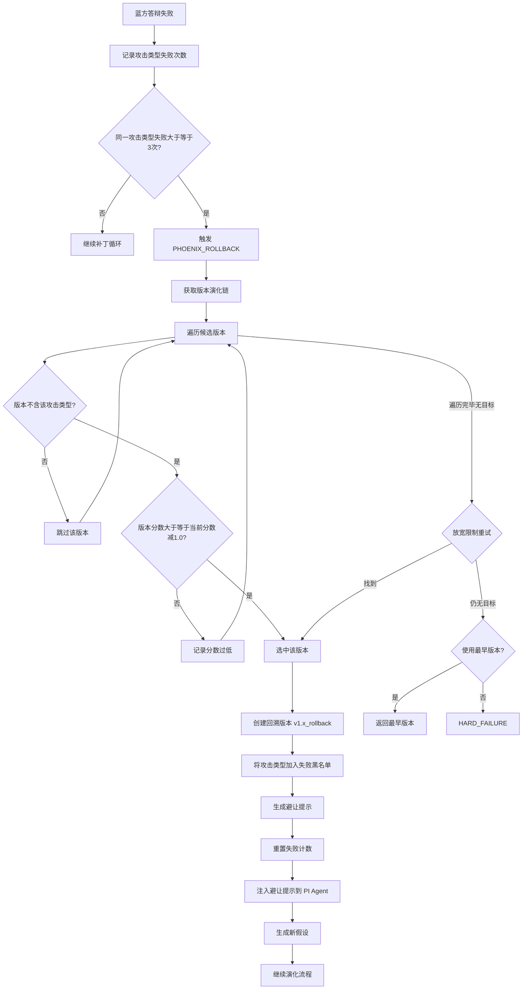
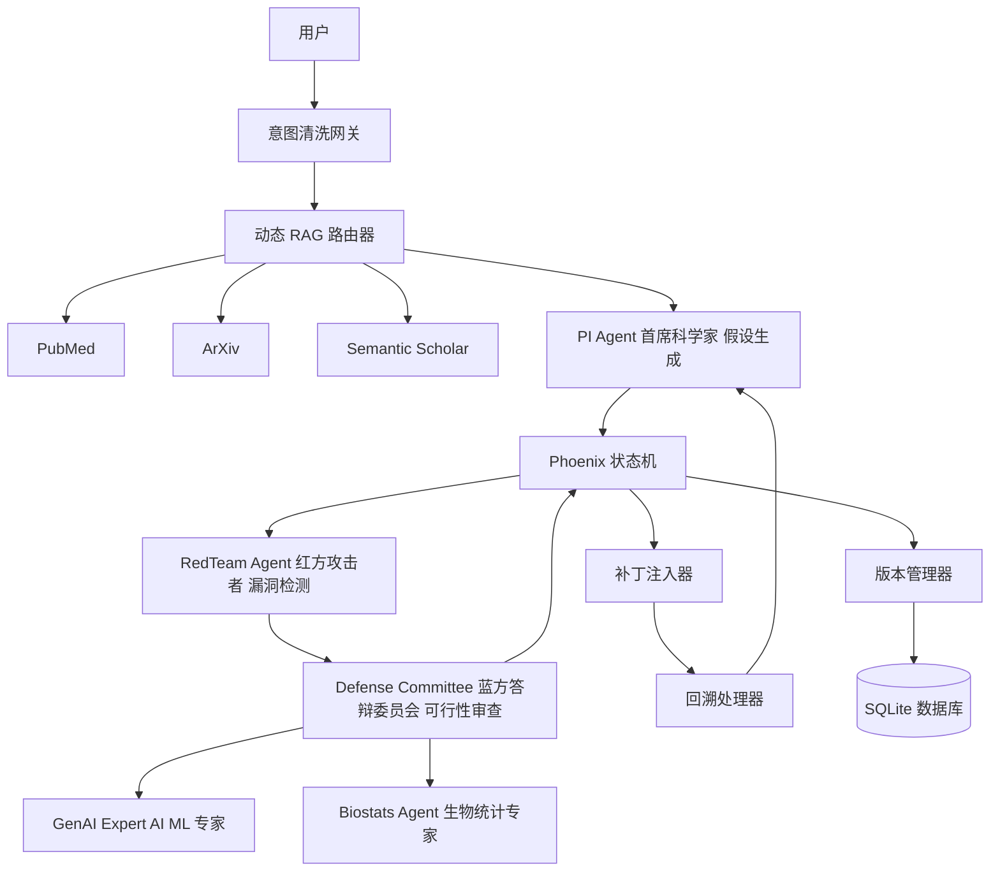
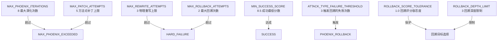

# 凤凰协议完整流程图

## 一、主流程图

## 二、状态机转换图

## 三、回溯机制详细流程

## 四、版本演化链示例

```mermaid
flowchart LR
    V1[v1.0 初始版本 Score 6.5] -->|Data Leakage| V2[v1.1 方法论补丁 Score 7.2]
    V2 -->|Endogeneity| V3[v1.2 方法论补丁 Score 8.2]
    V3 -->|蓝方通过| V4[v1.3 最终版本 Score 8.9]
    V5[v1.0 初始版本 Score 6.5] -->|Data Leakage| V6[v1.1 补丁 Score 7.2]
    V6 -->|Data Leakage 补丁无效| V7[v1.2 补丁 Score 7.5]
    V7 -->|Data Leakage 补丁无效| V8[v1.3 补丁 Score 7.8]
    V8 -->|Data Leakage 第3次失败| R1[触发回溯]
    R1 --> V9[v1.4_rollback 回溯恢复 注入避让提示]
    V9 -->|新研究方向| V10[v1.5 Score 8.2]
    V10 -->|蓝方通过| V11[v1.6 最终版本 Score 9.1]
    style R1 fill:#ff6b6b,color:#fff
    style V9 fill:#ffd93d,color:#000
    style V4 fill:#6bcb77,color:#fff
    style V11 fill:#6bcb77,color:#fff
```

## 五、智能体协作架构

## 六、配置参数关系图

---

## 使用说明

1. 将上述 Mermaid 代码复制到支持 Mermaid 的 Markdown 编辑器中查看
2. 推荐工具：
   - [Mermaid Live Editor](https://mermaid.live/)
   - VS Code + Mermaid 插件
   - GitHub/GitLab Markdown 预览
   - Notion / Obsidian
