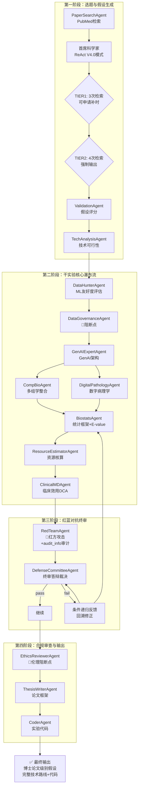

# 科研假设智能体集群 - 一图流 (V4.0)

## 系统架构全景图

```
┏━━━━━━━━━━━━━━━━━━━━━━━━━━━━━━━━━━━━━━━━━━━━━━━━━━━━━━━━━━━━━━━━━━━━━━━━━━━━━━━━━━━━━━━┓
┃                     科研假设智能体集群 (18-Agent System) V4.0                       ┃
┃                     基于 Claude 大模型的多智能体协作系统                            ┃
┃                     核心创新：ReAct实时查证 + 红蓝对抗 + 动态深度评估                 ┃
┗━━━━━━━━━━━━━━━━━━━━━━━━━━━━━━━━━━━━━━━━━━━━━━━━━━━━━━━━━━━━━━━━━━━━━━━━━━━━━━━━━━━━━━━┛

┌─────────────────────────────────────────────────────────────────────────────────────┐
│                              ▶ 第一阶段：选题与假设生成                               │
│  ─────────────────────────────────────────────────────────────────────────────────  │
│                                                                                     │
│   ┌──────────────┐         ┌────────────────────────────┐        ┌──────────────┐  │
│   │ PaperSearch  │  ────▶  │     首席科学家              │  ───▶  │ Validation   │  │
│   │   Agent      │         │   (ReAct V4.0 模式)        │        │   Agent      │  │
│   │              │         │                            │        │              │  │
│   │ PubMed检索   │         │  Thought → Action          │        │ 假设评分     │  │
│   │ 最新文献     │         │  → Observation 循环        │        │ 新颖性/严谨性│  │
│   │              │         │                            │        │              │  │
│   │              │         │  【动态深度评估机制】        │        └──────────────┘  │
│   │              │         │  ┌──────────────────────┐  │               │          │
│   │              │         │  │ TIER1: 3次检索      │  │               │          │
│   │              │         │  │ → 可申请补时窗口    │  │               │          │
│   │              │         │  │ TIER2: 4次检索      │  │               │          │
│   │              │         │  │ → 绝对强制输出      │  │               ▼          │
│   │              │         │  └──────────────────────┘  │        ┌──────────────┐  │
│   │              │         │                            │        │ TechAnalysis │  │
│   │              │         │  实时PubMed查证             │        │   Agent      │  │
│   │              │         │  七段式假设输出              │        │ 技术可行性   │  │
│   │              │         │  audit_info供红方审计       │        └──────────────┘  │
│   └──────────────┘         └────────────────────────────┘                           │
│                                                                                     │
└─────────────────────────────────────────────────────────────────────────────────────┘
                                           │
                                           ▼
┌─────────────────────────────────────────────────────────────────────────────────────┐
│                           ▶ 第二阶段：干实验核心瀑布流                                │
│  ─────────────────────────────────────────────────────────────────────────────────  │
│                                                                                     │
│   ┌──────────────┐   ┌──────────────┐   ┌──────────────┐   ┌──────────────┐       │
│   │ DataHunter   │─▶│DataGovernance│─▶│ GenAIExpert  │─▶│   CompBio    │       │
│   │   Agent      │   │    Agent     │   │    Agent     │   │    Agent     │       │
│   │              │   │              │   │              │   │              │       │
│   │ 数据集评估   │   │ 数据质量审计 │   │ GenAI架构    │   │ 多组学整合   │       │
│   │ ML友好度     │   │【🔴阻断点】 │   │ LLM/Diffusion│   │ QC协议       │       │
│   │ 样本量检测   │   │ 不达标终止   │   │ LoRA/RAG     │   │ 蛋白质结构   │       │
│   └──────────────┘   └──────────────┘   └──────────────┘   └──────────────┘       │
│                                                                                     │
│                              │                     │                                │
│                              │                     ▼                                │
│                              │            ┌──────────────┐                          │
│                              │            │DigitalPathol │                          │
│                              │            │    Agent     │                          │
│                              │            │ 数字病理学   │                          │
│                              │            │ WSI分析      │                          │
│                              │            └──────────────┘                          │
│                              │                     │                                │
│                              ▼                     ▼                                │
│                       ┌──────────────┐     ┌──────────────┐                         │
│                       │  Biostats    │ ──▶ │ResourceEstim │                         │
│                       │    Agent     │     │    Agent     │                         │
│                       │              │     │              │                         │
│                       │ 统计验证框架 │     │ 资源核算     │                         │
│                       │ E-value      │     │ GPU/人力预算 │                         │
│                       │ Power/FDR    │     │ 时间规划     │                         │
│                       │ 因果推断     │     └──────────────┘                         │
│                       └──────────────┘            │                                 │
│                                                   ▼                                 │
│                                          ┌──────────────┐                            │
│                                          │ ClinicalMD   │                            │
│                                          │    Agent     │                            │
│                                          │              │                            │
│                                          │ 临床效用评估 │                            │
│                                          │ DCA决策曲线  │                            │
│                                          │ NRI/IDI指标  │                            │
│                                          └──────────────┘                            │
│                                                                                     │
│   关键特性：严格串行依赖 │ 数据传递校验 │ 不完整方案阻断 │ audit_info传递           │
│                                                                                     │
└─────────────────────────────────────────────────────────────────────────────────────┘
                                           │
                                           ▼
┌─────────────────────────────────────────────────────────────────────────────────────┐
│                           ▶ 第三阶段：红蓝对抗终审                                    │
│  ─────────────────────────────────────────────────────────────────────────────────  │
│                                                                                     │
│   ┌──────────────────────────────────────────────────────────────────────────────┐ │
│   │                            红蓝对抗机制                                        │ │
│   │                                                                              │ │
│   │    蓝方防御材料                              红方攻击报告                    │ │
│   │   (GenAI+临床+病理+统计)                    (RedTeamAgent输出)               │ │
│   │         │    + audit_info                        │                          │ │
│   │         │    (检索审计日志)                      │                          │ │
│   │         └────────────┬───────────────────────────┘                          │ │
│   │                      ▼                                                      │ │
│   │            ┌──────────────────────┐                                         │ │
│   │            │ DefenseCommittee     │                                         │ │
│   │            │      Agent           │                                         │ │
│   │            │                      │                                         │ │
│   │            │  终审答辩裁决         │                                         │ │
│   │            │  ─────────────────   │                                         │ │
│   │            │  │ pass │ → 继续     │                                         │ │
│   │            │  │ fail │ → 反馈循环 │                                         │ │
│   │            └──────────────────────┘                                         │ │
│   │                      │                                                      │ │
│   │            ┌─────────┴─────────┐                                            │ │
│   │            ▼                   ▼                                            │ │
│   │         【通过】            【失败】                                         │ │
│   │            │                   │                                            │ │
│   │            ▼                   ▼                                            │ │
│   │         继续                条件递归反馈                                     │ │
│   │                            ─────────────                                    │ │
│   │                            回溯到Biostats                                   │ │
│   │                            或GenAIExpert                                    │ │
│   │                            携带审计意见修正                                  │ │
│   │                            → 重跑下游流程                                   │ │
│   │                            → 第二次终审                                     │ │
│   │                            (最多1次反馈循环)                                 │ │
│   │                                                                              │ │
│   │   【audit_info联动】                                                        │ │
│   │   如果申请了第4轮检索但未产生质变提升                                        │ │
│   │   → RedTeam批评"冗余调研"                                                   │ │
│   │                                                                              │ │
│   └──────────────────────────────────────────────────────────────────────────────┘ │
│                                                                                     │
│   红方攻击检查清单：                                                                 │
│   ┌────────────────┬────────────────┬────────────────┬────────────────┐           │
│   │   数据穿越     │  内生性偏倚    │  多重检验校正  │   统计功效     │           │
│   │  (Data Leakage)│ (Confounders)  │  (FDR缺失)     │  (Power不足)   │           │
│   └────────────────┴────────────────┴────────────────┴────────────────┘           │
│                                                                                     │
└─────────────────────────────────────────────────────────────────────────────────────┘
                                           │
                                           ▼
┌─────────────────────────────────────────────────────────────────────────────────────┐
│                           ▶ 第四阶段：合规审查与输出                                  │
│  ──────────────────────────────────────────────────────────────────────���──────────  │
│                                                                                     │
│   ┌──────────────┐   ┌──────────────┐   ┌──────────────┐                           │
│   │ EthicsReviewer│─▶│ ThesisWriter │─▶│   Coder      │                           │
│   │    Agent     │   │    Agent     │   │   Agent      │                           │
│   │              │   │              │   │              │                           │
│   │ 伦理合规审查 │   │ 论文框架撰写 │   │ 实验代码生成 │                           │
│   │ 数据泄露检测 │   │ Nature级别   │   │ Python/R     │                           │
│   │ 偏见消除     │   │ 方法论章节   │   │ 可执行代码   │                           │
│   │ HIPAA/GDPR   │   │ 结果章节     │   │ Pipeline     │                           │
│   │【🔴阻断点】 │   │              │   │              │                           │
│   └──────────────┘   └──────────────┘   └──────────────┘                           │
│                                                                                     │
└─────────────────────────────────────────────────────────────────────────────────────┘
                                           │
                                           ▼
┌─────────────────────────────────────────────────────────────────────────────────────┐
│                               ▶ 最终输出                                            │
│  ─────────────────────────────────────────────────────────────────────────────────  │
│                                                                                     │
│   ┌──────────────────────────────────────────────────────────────────────────────┐ │
│   │                                                                              ��� │
│   │   ✓ 博士论文开题级别的研究假设（七段式完整结构）                               │ │
│   │   ✓ 完整的技术路线（具体R包/Python库+函数名+参数）                            │ │
│   │   ✓ 统计验证框架（Power分析/E-value/FDR校正）                                │ │
│   │   ✓ 临床效用评估（DCA决策曲线/NRI/IDI指标）                                   │ │
│   │   ✓ 伦理合规审查报告                                                         │ │
│   │   ✓ 论文框架（方法论+结果章节）                                               │ │
│   │   ✓ 可执行实验代码                                                           │ │
│   │                                                                              │ │
│   └──────────────────────────────────────────────────────────────────────────────┘ │
│                                                                                     │
└─────────────────────────────────────────────────────────────────────────────────────┘


┏━━━━━━━━━━━━━━━━━━━━━━━━━━━━━━━━━━━━━━━━━━━━━━━━━━━━━━━━━━━━━━━━━━━━━━━━━━━━━━━━━━━━━━━┓
┃                              核心创新点 (7项)                                        ┃
┣━━━━━━━━━━━━━━━━━━━━━━━━━━━━━━━━━━━━━━━━━━━━━━━━━━━━━━━━━━━━━━━━━━━━━━━━━━━━━━━━━━━━━━━┫
┃                                                                                     ┃
┃  ① ReAct实时查证：假设生成过程主动检索PubMed，每句话有据可查                         ┃
┃                                                                                     ┃
┃  ② 动态深度评估(V4.0)：阶梯式压力（3次可申请补时，4次强制输出）                       ┃
┃     联动红方审计：补时申请记录供RedTeam批评"冗余调研"                                ┃
┃                                                                                     ┃
┃  ③ 红蓝对抗机制：引入攻击者角色，模拟顶级期刊审稿压力                                 ┃
┃                                                                                     ┃
┃  ④ 条件递归反馈：失败时自动回溯修正，而非直接终止                                     ┃
┃                                                                                     ┃
┃  ⑤ 多轨并行优选：一次生成3个方向，快速筛选最高分                                      ┃
┃                                                                                     ┃
┃  ⑥ 严格串行依赖：数据传递校验，阻断不完整方案                                         ┃
┃                                                                                     ┃
┃  ⑦ 纯数据指标评估：DCA/NRI量化临床效用，而非模糊描述                                  ┃
┃                                                                                     ┃
┗━━━━━━━━━━━━━━━━━━━━━━━━━━━━━━━━━━━━━━━━━━━━━━━━━━━━━━━━━━━━━━━━━━━━━━━━━━━━━━━━━━━━━━━┛


┏━━━━━━━━━━━━━━━━━━━━━━━━━━━━━━━━━━━━━━━━━━━━━━━━━━━━━━━━━━━━━━━━━━━━━━━━━━━━━━━━━━━━━━━┓
┃                              阻断点机制                                              ┃
┣━━━━━━━━━━━━━━━━━━━━━━━━━━━━━━━━━━━━━━━━━━━━━━━━━━━━━━━━━━━━━━━━━━━━━━━━━━━━━━━━━━━━━━━┫
┃                                                                                     ┃
┃   ┌────────────────────────────────────────────────────────────────────────────┐   ┃
┃   │  阻断点              │  条件                    │  行为                   │   ┃
┃   ├──────────────────────┼──────────────────────────┼─────────────────────────┤   ┃
┃   │  数据治理审计        │  ML友好度='poor'         │  工作流终止             │   ┃
┃   │  上游数据校验        │  数据缺失/无效           │  抛出异常               │   ┃
┃   │  红蓝对抗终审        │  defense_passed=False    │  触发反馈循环           │   ┃
┃   │  伦理合规审查        │  approved=False          │  工作流终止             │   ┃
┃   │  LLM解析失败         │  max_retries耗尽         │  抛出RuntimeError       │   ┃
┃   └────────────────────────────────────────────────────────────────────────────┘   ┃
┃                                                                                     ┃
┗━━━━━━━━━━━━━━━━━━━━━━━━━━━━━━━━━━━━━━━━━━━━━━━━━━━━━━━━━━━━━━━━━━━━━━━━━━━━━━━━━━━━━━━┛


┏━━━━━━━━━━━━━━━━━━━━━━━━━━━━━━━━━━━━━━━━━━━━━━━━━━━━━━━━━━━━━━━━━━━━━━━━━━━━━━━━━━━━━━━┓
┃                         V4.0 动态深度评估机制详解                                     ┃
┣━━━━━━━━━━━━━━━━━━━━━━━━━━━━━━━━━━━━━━━━━━━━━━━━━━━━━━━━━━━━━━━━━━━━━━━━━━━━━━━━━━━━━━━┫
┃                                                                                     ┃
┃   ┌────────────────────────────────────────────────────────────────────────────┐   ┃
┃   │                        阶梯式指令压力                                        │   ┃
┃   ├────────────────────────────────────────────────────────────────────────────┤   ┃
┃   │                                                                            │   ┃
┃   │   TIER1 (成功检索 3 次)                                                     │   ┃
┃   │   ─────────────────────────────────────────────────────────────────────    │   ┃
┃   │   │ 注入提示："原则上你应该立即进入合成模式"                                │   ┃
┃   │   │ 但如果你认为"证据链存在致命缺环"：                                      │   ┃
┃   │   │   → 可在 Thought 中申请第 4 轮补���                                      │   ┃
┃   │   │   → 必须明确说明：将解决哪个因果逻辑断裂                                │   ┃
┃   │   ─────────────────────────────────────────────────────────────────────    │   ┃
┃   │                                                                            │   ┃
┃   │   TIER2 (成功检索 4 次)                                                     │   ┃
┃   │   ─────────────────────────────────────────────────────────────────────    │   ┃
┃   │   │ 注入死命令："检索权限已耗尽"                                            │   ┃
┃   │   │ 禁止继续调用 search_pubmed                                              │   ┃
┃   │   │ 必须立即输出 JSON                                                       │   ┃
┃   │   ─────────────────────────────────────────────────────────────────────    │   ┃
┃   │                                                                            │   ┃
┃   └────────────────────────────────────────────────────────────────────────────┘   ┃
┃                                                                                     ┃
┃   ┌────────────────────────────────────────────────────────────────────────────┐   ┃
┃   │                        联动红方审计                                          │   ┃
┃   ├────────────────────────────────────────────────────────────────────────────┤   ┃
┃   │                                                                            │   ┃
┃   │   audit_info 字段包含：                                                     │   ┃
┃   │   ├── successful_searches: 检索次数                                         │   ┃
┃   │   ├── requested_extra_search: 是否申请补时                                  │   ┃
┃   │   ├── extra_search_reason: 补时��由                                         │   ┃
┃   │   ├── efficiency_score: 效率评分                                            │   ┃
┃   │   └── audit_summary: 审计摘要（供红方直接引用）                              │   ┃
┃   │                                                                            │   ┃
┃   │   审计要点：                                                                │   ┃
┃   │   如果 requested_extra_search=True 但假设未产生质变提升                     │   ┃
┃   │   → RedTeamAgent 批评"冗余调研"                                             │   ┃
┃   │                                                                            │   ┃
┃   └────────────────────────────────────────────────────────────────────────────┘   ┃
┃                                                                                     ┃
┃   ┌────────────────────────────────────────────────────────────────────────────┐   ┃
┃   │                        反馈循环保护                                          │   ┃
┃   ├────────────────────────────────────────────────────────────────────────────┤   ┃
┃   │                                                                            │   ┃
┃   │   单次迭代精简是为了整体效率：                                               │   ┃
┃   │                                                                            │   ┃
┃   │   3次检索 → 输出假设 → RedTeam审计                                          │   ┃
┃   │                          ↓                                                 │   ┃
┃   │              如果审计判定"证据不足"                                         │   ┃
┃   │              → 携意见开启下一轮迭代                                          │   ┃
┃   │              → 外层循环保证最终质量                                          │   ┃
┃   │                                                                            │   ┃
┃   └────────────────────────────────────────────────────────────────────���───────┘   ┃
┃                                                                                     ┃
┗━━━━━━━━━━━━━━━━━━━━━━━━━━━━━━━━━━━━━━━━━━━━━━━━━━━━━━━━━━━━━━━━━━━━━━━━━━━━━━━━━━━━━━━┛


┏━━━━━━━━━━━━━━━━━━━━━━━━━━━━━━━━━━━━━━━━━━━━━━━━━━━━━━━━━━━━━━━━━━━━━━━━━━━━━━━━━━━━━━━┓
┃                              智能体清单 (18个)                                       ┃
┣━━━━━━━━━━━━━━━━━━━━━━━━━━━━━━━━━━━━━━━━━━━━━━━━━━━━━━━━━━━━━━━━━━━━━━━━━━━━━━━━━━━━━━━┫
┃                                                                                     ┃
┃   【选题阶段】                              【干实验阶段】                           ┃
┃   PaperSearchAgent      PubMed检索         DataHunterAgent      ML友好度评估       ┃
┃   ChiefScientistAgent   假设生成(ReAct)    DataGovernanceAgent  数据质量审计       ┃
┃   ValidationAgent       假设评分            GenAIExpertAgent     GenAI架构         ┃
┃   TechAnalysisAgent     技术可行性          CompBioAgent         多组学整合         ┃
┃                                            DigitalPathologyAgent 数字病理学         ┃
┃                                            BiostatsAgent         统计框架           ┃
┃                                            ResourceEstimatorAgent 资源核算          ┃
┃                                            ClinicalMDAgent       临床效用           ┃
┃                                                                                     ┃
┃   【终审阶段】                              【输出阶段】                             ┃
┃   RedTeamAgent          红方攻击            EthicsReviewerAgent  伦理审查           ┃
┃   DefenseCommitteeAgent 终审裁决            ThesisWriterAgent    论文框架           ┃
┃                                            CoderAgent            实验代码           ┃
┃                                                                                     ┃
┗━━━━━━━━━━━━━━━━━━━━━━━━━━━━━━━━━━━━━━━━━━━━━━━━━━━━━━━━━━━━━━━━━━━━━━━━━━━━━━━━━━━━━━━┛
```

## Mermaid 流程图版本



## 技术栈

| 层级 | 技术 |
|------|------|
| LLM层 | Claude Opus/Sonnet (Anthropic) |
| 工具调用 | Claude Tool Use Protocol |
| 数据层 | SQLite + SQLAlchemy |
| 文献源 | PubMed API (Entrez) |
| 前端 | Streamlit |
| 日志 | Python logging + 实时输出 |

## 运行时日志示例

```
┌──────────────────────────────────────────────────────────┐
│  🧠 第 4 轮思考 - 首席科学家                              │
│  📚 成功检索次数: 3 (压力层级: T1)                        │
└──────────────────────────────────────────────────────────┘

   🟡 [TIER1 压力] 已获取 3 份核心证据
   → 可申请第 4 轮补时，但需在 Thought 中明确说明理由

   💭 Thought: 基于目前3份证据，我发现核心因果链路中缺失了...
              因此申请第4轮检索来解决这一问题...

   🎬 Action (行动):
   调用工具: search_pubmed
   参数: {"query": "threshold effect hippocampus"}

   👁️  Observation (观察):
   检索到 2 篇相关文献...

   📝 补时申请已记录
   理由: 因果链路缺失阈值效应证据
   效率评分: 0.75

   🔴 [TIER2 压力] 检索权限已耗尽，强制输出
   → 必须立即基于现有证据生成假设

┌──────────────────────────────────────────────────────────┐
│  ✅ [ReAct 思考链完成]                                    │
│     总轮次: 5 轮                                          │
│     成功检索: 4 次                                        │
│     申请补时: 是                                          │
│     audit_info 已生成供红方审计                           │
└──────────────────────────────────────────────────────────┘
```